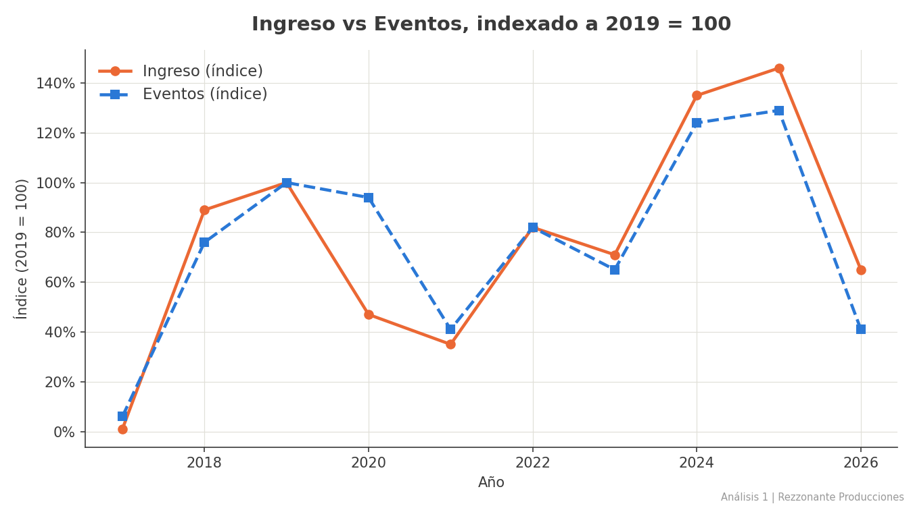
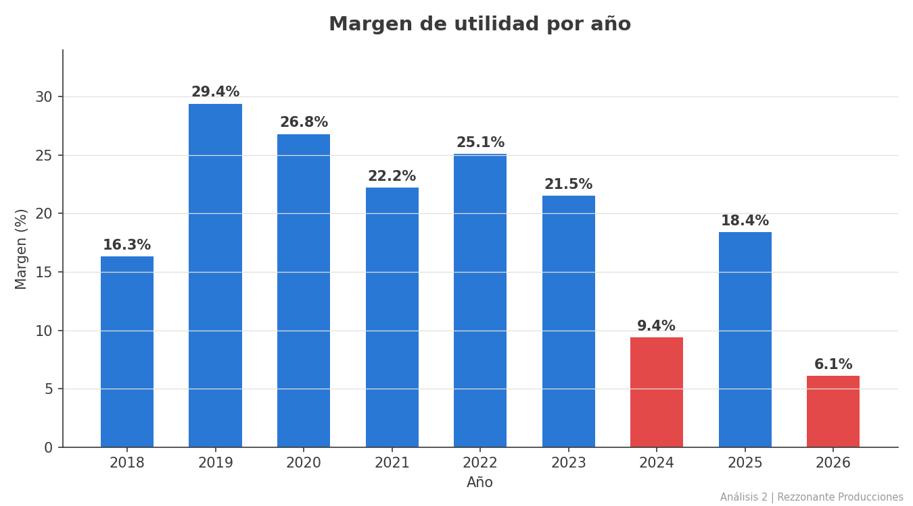
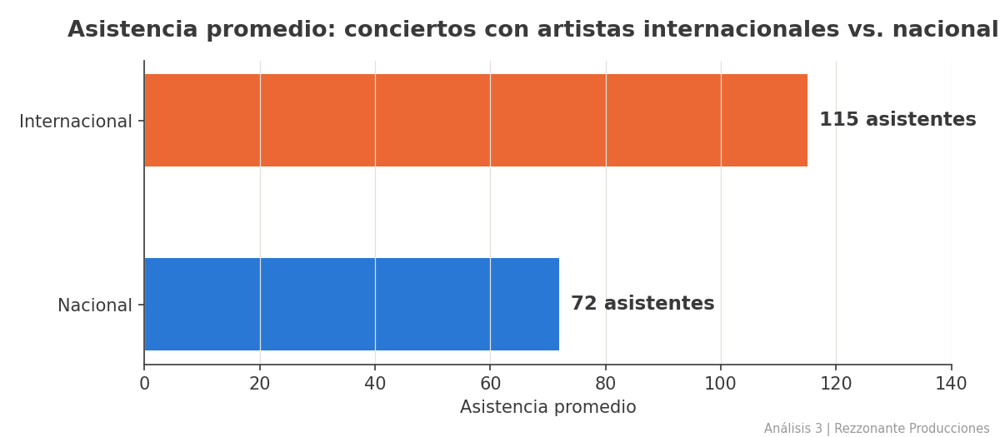
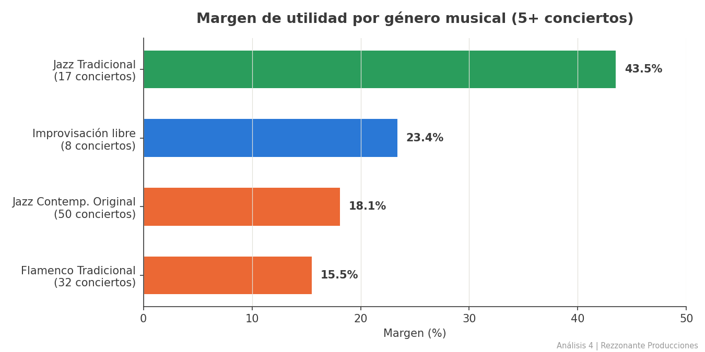

# Rezzonante Producciones — De Excel disperso a inteligencia de negocio

**Autor:** Eleazar Soto · [github.com/eleazarsoto](https://github.com/eleazarsoto)

*[English](#english) | [Español](#español)*

---

## English

### The story

I've spent 9 years running **Rezzonante Producciones**, a jazz and improvised-music production project in Ajijic, Mexico — booking artists, managing venues, tracking attendance and payments, one spreadsheet at a time. In 2026 I started learning data analysis from scratch. This project is where those two paths meet: I took my own real, messy, 9-year business dataset and turned it into a proper analytical system — not a tutorial exercise, a real one.

Every number in this project came from an actual concert I produced. Every data-quality issue I found and fixed — broken formulas, mistyped attendance figures, sponsor-covered events that needed different accounting — was a real decision made together with the person who actually runs the business (me, wearing two hats: the client and the analyst).

### What this project demonstrates

| Layer | What it shows |
|---|---|
| **Data modeling** | Redesigned a flat spreadsheet into a normalized relational schema — a fact table (`conciertos`), a bridge table (`artistas`), a master catalog (`catalogo_artistas`), and rate-reference tables — mirroring the star-schema thinking taught in data warehousing |
| **Data quality & governance** | A documented, multi-round audit process: fixed misaligned formula references, consolidated duplicate catalog entries, resolved sponsor-funded events, corrected capture errors — all confirmed with the actual business owner before applying |
| **SQL analysis** | 4 business-question-driven analyses, from CTEs and window-function-adjacent patterns to careful `HAVING`/`GROUP BY` logic, each framed with a **CoNVO** (Context-Need-Vision-Outcome) before a single query was written |
| **Data storytelling** | Every chart has a conclusion as its title, not a description — following Cole Nussbaumer Knaflic's *Storytelling with Data* |

### Project structure

```
rezzonante-data-analysis/
├── README.md
├── Rezzonante_Producciones.db              # SQLite export, final version
├── sql/
│   ├── rezzonante_01_trayectoria_historica.sql
│   ├── rezzonante_02_economia_unitaria.sql
│   ├── rezzonante_03_artistas.sql
│   └── rezzonante_04_sedes_generos.sql
└── charts/
    ├── a1_indice_ingreso_eventos.png
    ├── a2_margen_por_anio.png
    ├── a3_nacional_vs_internacional.png
    └── a4_margen_por_genero.png
```

### The four analyses

**1 — Historical trajectory: events and revenue (2017-2026)**



Revenue grew faster than event volume — the gap widens every year since 2022. By 2025, revenue reached 146% of the 2019 (pre-pandemic) baseline, with only 129% of the event volume.

**2 — Unit economics: real margin per concert**



No year closed in the red — but margin compresses exactly in the highest-revenue years. 2024, the peak revenue year, delivered only 9.4% margin, versus 29.4% in 2019. Root cause identified: 2024-2025 concentrate far more high-fixed-cost events than any prior year.

**3 — Artist network: does international programming pay off?**



Concerts featuring at least one international artist draw **60% more attendance** on average (115 vs. 72) than fully domestic lineups — turning "we book international talent" from a prestige claim into a measurable return.

**4 — Venues and genres: what actually performs**



The genre that dominates programming (Jazz Contemporáneo Original, 38% of all concerts) is *not* the most profitable one — Jazz Tradicional delivers 43.5% margin on just 13% of the catalog.

### Tools

SQLite · SQLiteViz · Google Sheets/Excel (openpyxl) · Python (pandas) · Matplotlib

### What's next

Python scripts for the data-cleaning pipeline (currently ad-hoc), an entity-relationship diagram of the schema, and a Looker Studio dashboard connected live to the source spreadsheet.

---

## Español

### La historia

Llevo 9 años dirigiendo **Rezzonante Producciones**, un proyecto de producción de jazz y música improvisada en Ajijic, México — contratando artistas, gestionando sedes, registrando asistencia y pagos, una hoja de cálculo a la vez. En 2026 empecé a aprender análisis de datos desde cero. Este proyecto es donde esos dos caminos se encuentran: tomé mi propia base de datos real, de 9 años, con todo su desorden, y la convertí en un sistema analítico de verdad — no un ejercicio de tutorial, uno real.

Cada número de este proyecto viene de un concierto que produje de verdad. Cada problema de calidad de dato que encontré y corregí —fórmulas rotas, cifras de asistencia mal tecleadas, eventos patrocinados que necesitaban una contabilidad distinta— fue una decisión real, tomada junto con quien de verdad dirige el negocio (yo, con dos sombreros: el cliente y el analista).

### Qué demuestra este proyecto

| Capa | Qué muestra |
|---|---|
| **Modelado de datos** | Rediseñé una hoja de cálculo plana en un esquema relacional normalizado — una tabla de hechos (`conciertos`), una tabla puente (`artistas`), un catálogo maestro (`catalogo_artistas`), y tablas de referencia de tarifas — con la misma lógica de esquema estrella que se enseña en modelado de datos |
| **Calidad y gobernanza de datos** | Un proceso de auditoría documentado en varias rondas: reparé referencias de fórmula desalineadas, consolidé duplicados en el catálogo, resolví eventos patrocinados, corregí errores de captura — todo confirmado con el dueño real del negocio antes de aplicarlo |
| **Análisis SQL** | 4 análisis guiados por preguntas de negocio, desde CTEs hasta lógica cuidadosa de `HAVING`/`GROUP BY`, cada uno encuadrado con un **CoNVO** (Contexto-Necesidad-Visión-Outcome) antes de escribir una sola consulta |
| **Storytelling de datos** | Cada gráfica lleva una conclusión como título, no una descripción — siguiendo *Storytelling with Data* de Cole Nussbaumer Knaflic |

### Estructura del proyecto

```
rezzonante-data-analysis/
├── README.md
├── Rezzonante_Producciones.db              # Exportación SQLite, versión final
├── sql/
│   ├── rezzonante_01_trayectoria_historica.sql
│   ├── rezzonante_02_economia_unitaria.sql
│   ├── rezzonante_03_artistas.sql
│   └── rezzonante_04_sedes_generos.sql
└── charts/
    ├── a1_indice_ingreso_eventos.png
    ├── a2_margen_por_anio.png
    ├── a3_nacional_vs_internacional.png
    └── a4_margen_por_genero.png
```

### Los cuatro análisis

**1 — Trayectoria histórica: eventos e ingreso (2017-2026)**


El ingreso creció más rápido que el volumen de eventos — la brecha se amplía cada año desde 2022. Para 2025, el ingreso alcanzó 146% del nivel pre-pandemia (2019), con solo 129% del volumen de eventos.

**2 — Economía unitaria: margen real por concierto**


Ningún año cerró en números rojos — pero el margen se comprime justo en los años de mayor ingreso. 2024, el año pico de facturación, dejó solo 9.4% de margen, contra 29.4% en 2019. Causa raíz identificada: 2024-2025 concentran muchos más eventos de alto costo fijo que cualquier año anterior.

**3 — Red de artistas: ¿la programación internacional rinde?**


Los conciertos con al menos un artista internacional convocan **60% más público** en promedio (115 vs. 72) que las formaciones 100% nacionales — convirtiendo "programamos talento internacional" de una afirmación de prestigio en un retorno medible.

**4 — Sedes y géneros: qué rinde de verdad**


El género que domina la programación (Jazz Contemporáneo Original, 38% de los conciertos) *no* es el más rentable — Jazz Tradicional entrega 43.5% de margen con solo el 13% del catálogo.

### Herramientas

SQLite · SQLiteViz · Google Sheets/Excel (openpyxl) · Python (pandas) · Matplotlib

### Lo que sigue

Scripts de Python para formalizar el proceso de limpieza (hoy ad-hoc), un diagrama entidad-relación del esquema, y un dashboard de Looker Studio conectado en vivo a la hoja de cálculo fuente.

---

*De gestionar un proyecto cultural con hojas de cálculo, a convertir esos mismos datos en decisiones — este es el proyecto que documenta esa transición.*
