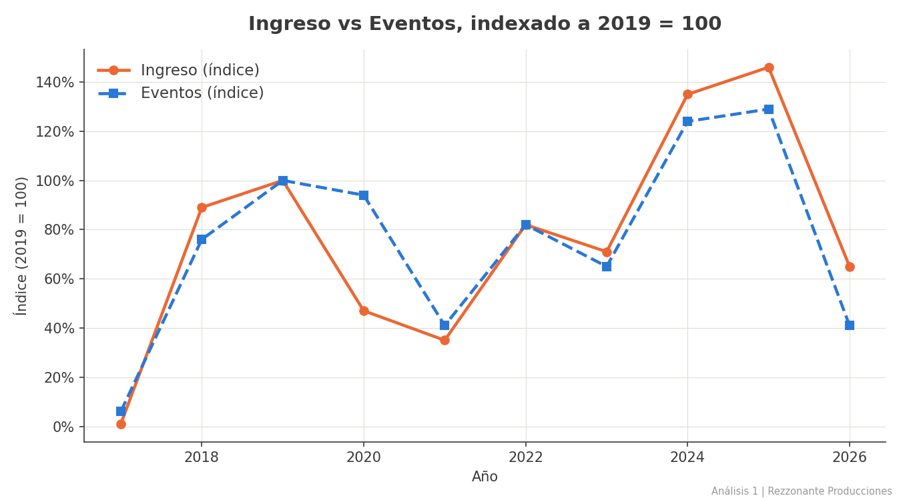
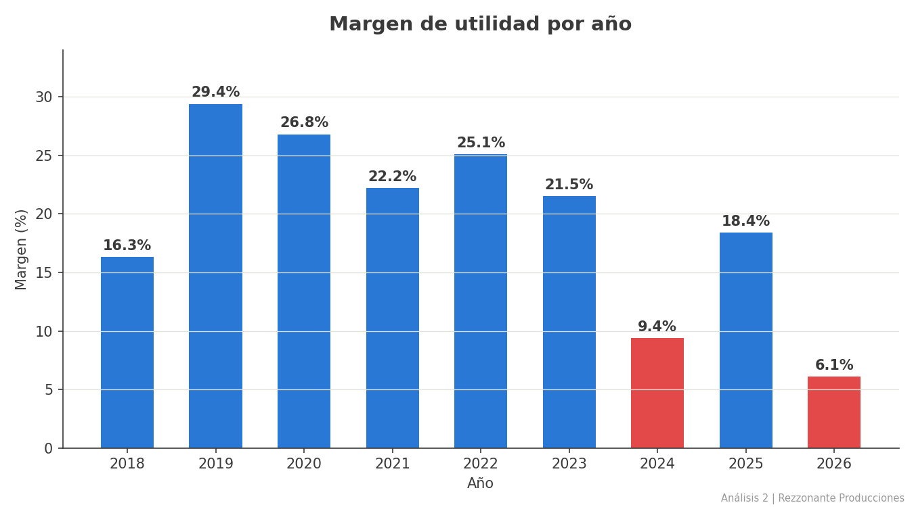
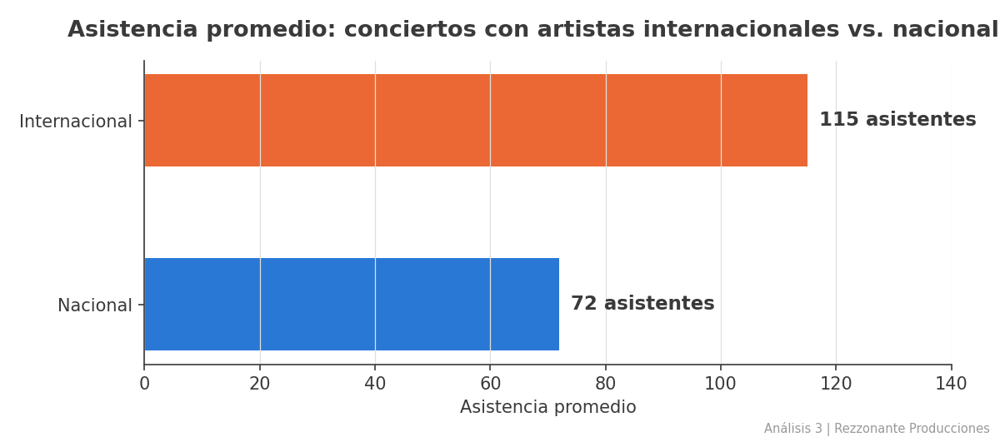
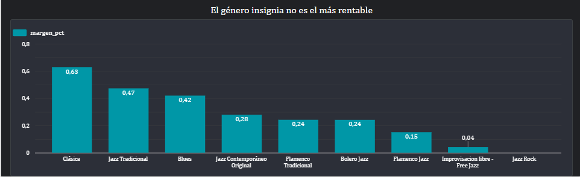
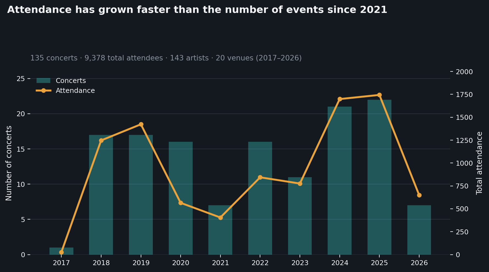
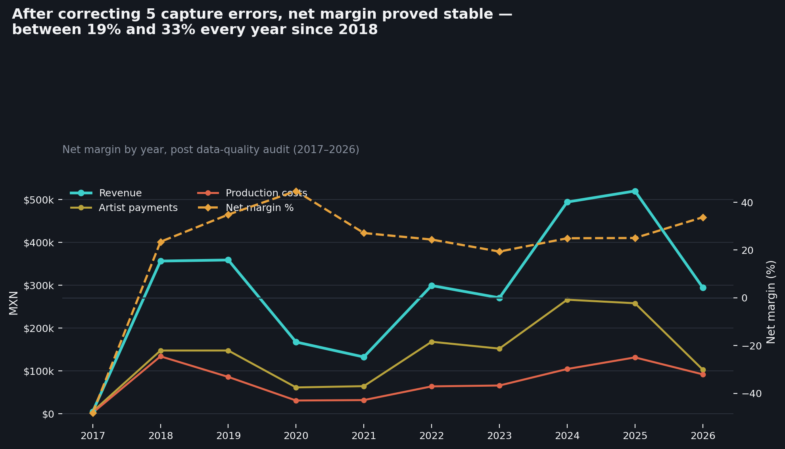
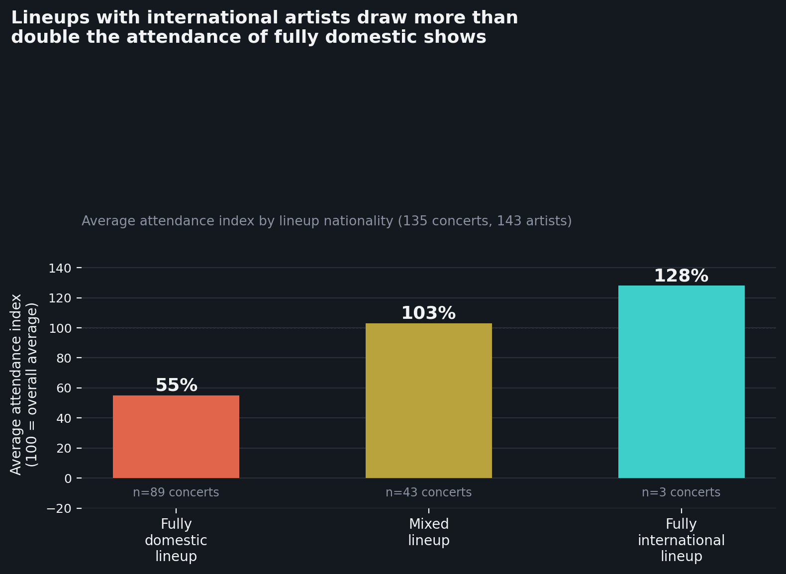

# Rezzonante Producciones — De Excel disperso a inteligencia de negocio

**Autor:** Eleazar Soto · [github.com/eleazarsoto](https://github.com/eleazarsoto)

*[English](#english) | [Español](#español)*

---

## English

### The story

For 9 years, **Rezzonante Producciones** has been producing jazz and improvised-music events in Ajijic, Mexico — booking artists, managing venues, tracking attendance and payments, one spreadsheet at a time. I founded Rezzonante and lead it as artistic director, and a small team helps bring every event to life. In 2026 I started learning data analysis from scratch. This project is where those two paths meet: I took Rezzonante's own real, messy, 9-year business dataset and turned it into a proper analytical system — not a tutorial exercise, a real one.

Every number in this project came from an actual concert Rezzonante produced. Every data-quality issue found and fixed — broken formulas, mistyped attendance figures, sponsor-covered events that needed different accounting — was a real decision, confirmed with the people who actually run the business before a single change was applied.

The project has since grown beyond SQL analysis into a live BI dashboard on BigQuery and Looker Studio — the full pipeline is documented below.

### What this project demonstrates

| Layer | What it shows |
|---|---|
| **Data modeling** | Built a spreadsheet database designed from the ground up as a normalized relational schema — a fact table (`conciertos`), a bridge table (`artistas`), a master catalog (`catalogo_artistas`), and rate-reference tables — mirroring the star-schema thinking taught in data warehousing. Every record was researched and reconstructed by hand from a calendar of dates and graphic materials — event posters and promotional flyers, not a pre-existing ledger |
| **Data quality & governance** | A documented, multi-round audit process across both the SQL and BigQuery stages: fixed misaligned formula references, consolidated duplicate catalog entries, resolved sponsor-funded events, corrected capture errors — all confirmed with the actual business owner before applying |
| **SQL analysis** | 4 business-question-driven analyses, from CTEs and window-function-adjacent patterns to careful `HAVING`/`GROUP BY` logic, each one opens with a short problem framing — business context, the specific question, what a good answer looks like, the decision it unlocks — before a single query is written |
| **Cloud data warehousing** | Migrated the full relational schema to Google BigQuery, resolving real-world ingestion issues (header-detection failures, schema mismatches) along the way |
| **BI dashboarding** | Built a 6-page interactive dashboard in Looker Studio, connected live to BigQuery, with cross-page navigation and business-question-driven page titles |
| **Data storytelling** | Every chart has a conclusion as its title, not a description — following Cole Nussbaumer Knaflic's *Storytelling with Data* |

### Project structure

```
rezzonante-data-analysis/
├── README.md
├── Rezzonante_Producciones.db              # SQLite export, final version
├── sql/
│   ├── rezzonante_01_trayectoria_historica.sql
│   ├── rezzonante_02_economia_unitaria.sql
│   ├── rezzonante_03_artistas.sql
│   └── rezzonante_04_sedes_generos.sql
├── bigquery/
│   ├── margen_neto_por_anio.sql
│   ├── ingreso_por_produccion_sede.sql
│   ├── asistencia_total_por_anio.sql
│   └── nacionalidad_artistas.sql
└── charts/
    ├── a1_indice_ingreso_eventos.png
    ├── a2_margen_por_anio.png
    ├── a3_nacional_vs_internacional.png
    ├── a4_margen_por_genero.png
    ├── b1_resumen_general.png
    ├── b2_margen_neto_por_anio.png
    └── b3_nacionalidad_asistencia.png
```

### The four analyses

**1 — Historical trajectory: events and revenue (2017-2026)**



Revenue grew faster than event volume — the gap widens every year since 2022. By 2025, revenue reached 145% of the 2019 (pre-pandemic) baseline, with only 129% of the event volume.

**2 — Unit economics: real margin per concert**



No year closed in the red — but margin compresses exactly in the highest-revenue years. 2024, the peak revenue year, delivered only 11.9% margin, versus 30.3% in 2019. Root cause identified: 2024-2025 concentrate far more high-fixed-cost events than any prior year.

**3 — Artist network: does international programming pay off?**



Concerts featuring at least one international artist draw **58% more attendance** on average (117 vs. 74) than fully domestic lineups — turning "we book international talent" from a prestige claim into a measurable return.

**4 — Venues and genres: what actually performs**



The genre that dominates programming (Jazz Contemporáneo Original, 38% of all concerts) is *not* the most profitable one — Jazz Tradicional delivers 44.8% margin, still ahead of the flagship genre's 25.4%.

### From SQL to BI: the BigQuery + Looker Studio dashboard

The same dataset behind the four analyses above now lives in **Google BigQuery** and feeds a live, multi-page dashboard in **Looker Studio**.

**Data quality audit, round two.** Before trusting the data enough to dashboard it, I ran a second, more granular audit on the production-cost and attendance fields — this time comparing every individual event against the pattern of its own production line across years, not just spot-checking totals. That surfaced 5 additional capture errors invisible at the aggregate level:

- A fixed production cost ($20,000 MXN) had been applied identically to 8 small satellite venues of one touring production, regardless of their actual revenue — masking which venues were genuinely profitable and which weren't
- A duplicated event row had doubled a production's real cost
- A phantom $20,000 production cost was recorded for an online event with no real production spend
- Two attendance records had internal inconsistencies between general and total counts

**The result mattered**: before correction, net margin appeared to have collapsed from ~19% (2023) to ~7% (2025) — a false signal that would have driven the wrong strategic conversation. After correction, margin proved **stable between 19% and 33% every year since 2018.**

**The dashboard** — six pages, each built around a specific business question:

| Page | Business question it answers |
|---|---|
| Index | Navigation hub |
| General Report | How is the business doing, at a glance? |
| Artists | Who's performing, and how often? |
| Net Margin | How much are we really keeping per event? |
| Estimated Revenue | Which productions and venues generate the most revenue? |
| Attendance | How is our audience growing? |
| Nationality | Does booking international talent actually drive attendance? |

🔗 **[View the live dashboard on Looker Studio](https://datastudio.google.com/reporting/9743acdc-7607-48e6-bacd-4db00c438d0b)**







### Tools

SQLite · SQLiteViz · Google Sheets/Excel (openpyxl) · Python (pandas) · Matplotlib · Google BigQuery · Looker Studio

### What's next

Python scripts for the data-cleaning pipeline (currently ad-hoc), an entity-relationship diagram of the schema, a defined North Star Metric for the dashboard, and confidence-rated findings (flagging which insights are high-certainty vs. directional) as the analysis matures.

---

## Español

### La historia

Desde hace 9 años, **Rezzonante Producciones** produce eventos de jazz y música improvisada en Ajijic, México — contratando artistas, gestionando sedes, registrando asistencia y pagos, una hoja de cálculo a la vez. Fundé Rezzonante y la dirijo como director artístico, con un equipo pequeño que ayuda a que cada evento suceda. En 2026 empecé a aprender análisis de datos desde cero. Este proyecto es donde esos dos caminos se encuentran: tomé la propia base de datos real de Rezzonante, de 9 años, con todo su desorden, y la convertí en un sistema analítico de verdad — no un ejercicio de tutorial, uno real.

Cada número de este proyecto viene de un concierto que Rezzonante produjo de verdad. Cada problema de calidad de dato que se encontró y corrigió —fórmulas rotas, cifras de asistencia mal tecleadas, eventos patrocinados que necesitaban una contabilidad distinta— fue una decisión real, confirmada con quienes de verdad dirigen el negocio antes de aplicar un solo cambio.

El proyecto creció más allá del análisis en SQL hasta convertirse en un dashboard de BI en vivo, sobre BigQuery y Looker Studio — el recorrido completo está documentado más abajo.

### Qué demuestra este proyecto

| Capa | Qué muestra |
|---|---|
| **Modelado de datos** | Construí una base de datos en hojas de cálculo diseñada desde cero como un esquema relacional normalizado — una tabla de hechos (`conciertos`), una tabla puente (`artistas`), un catálogo maestro (`catalogo_artistas`), y tablas de referencia de tarifas — con la misma lógica de esquema estrella que se enseña en modelado de datos. Cada registro fue investigado y reconstruido a mano a partir de un calendario de fechas y material gráfico — pósters y publicidad de los eventos, no un registro contable preexistente |
| **Calidad y gobernanza de datos** | Un proceso de auditoría documentado en varias rondas, tanto en la etapa de SQL como en BigQuery: reparé referencias de fórmula desalineadas, consolidé duplicados en el catálogo, resolví eventos patrocinados, corregí errores de captura — todo confirmado con el dueño real del negocio antes de aplicarlo |
| **Análisis SQL** | 4 análisis guiados por preguntas de negocio, desde CTEs hasta lógica cuidadosa de `HAVING`/`GROUP BY`, cada uno arranca con un encuadre breve —contexto de negocio, la pregunta específica, cómo se ve una buena respuesta, la decisión que habilita— antes de escribir una sola consulta |
| **Data warehousing en la nube** | Migré el esquema relacional completo a Google BigQuery, resolviendo problemas reales de ingesta (fallas de detección de encabezados, desajustes de esquema) en el camino |
| **Dashboards de BI** | Construí un dashboard interactivo de 6 páginas en Looker Studio, conectado en vivo a BigQuery, con navegación entre páginas y títulos guiados por preguntas de negocio |
| **Storytelling de datos** | Cada gráfica lleva una conclusión como título, no una descripción — siguiendo *Storytelling with Data* de Cole Nussbaumer Knaflic |

### Estructura del proyecto

```
rezzonante-data-analysis/
├── README.md
├── Rezzonante_Producciones.db              # Exportación SQLite, versión final
├── sql/
│   ├── rezzonante_01_trayectoria_historica.sql
│   ├── rezzonante_02_economia_unitaria.sql
│   ├── rezzonante_03_artistas.sql
│   └── rezzonante_04_sedes_generos.sql
├── bigquery/
│   ├── margen_neto_por_anio.sql
│   ├── ingreso_por_produccion_sede.sql
│   ├── asistencia_total_por_anio.sql
│   └── nacionalidad_artistas.sql
└── charts/
    ├── a1_indice_ingreso_eventos.png
    ├── a2_margen_por_anio.png
    ├── a3_nacional_vs_internacional.png
    ├── a4_margen_por_genero.png
    ├── b1_resumen_general.png
    ├── b2_margen_neto_por_anio.png
    └── b3_nacionalidad_asistencia.png
```

### Los cuatro análisis

**1 — Trayectoria histórica: eventos e ingreso (2017-2026)**


El ingreso creció más rápido que el volumen de eventos — la brecha se amplía cada año desde 2022. Para 2025, el ingreso alcanzó 145% del nivel pre-pandemia (2019), con solo 129% del volumen de eventos.

**2 — Economía unitaria: margen real por concierto**


Ningún año cerró en números rojos — pero el margen se comprime justo en los años de mayor ingreso. 2024, el año pico de facturación, dejó solo 11.9% de margen, contra 30.3% en 2019. Causa raíz identificada: 2024-2025 concentran muchos más eventos de alto costo fijo que cualquier año anterior.

**3 — Red de artistas: ¿la programación internacional rinde?**


Los conciertos con al menos un artista internacional convocan **58% más público** en promedio (117 vs. 74) que las formaciones 100% nacionales — convirtiendo "programamos talento internacional" de una afirmación de prestigio en un retorno medible.

**4 — Sedes y géneros: qué rinde de verdad**


El género que domina la programación (Jazz Contemporáneo Original, 38% de los conciertos) *no* es el más rentable — Jazz Tradicional entrega 44.8% de margen, todavía por encima del 25.4% del género insignia.

### De SQL a BI: el dashboard de BigQuery + Looker Studio

La misma base de datos detrás de los cuatro análisis anteriores ahora vive en **Google BigQuery** y alimenta un dashboard en vivo, multipágina, en **Looker Studio**.

**Auditoría de calidad de datos, segunda ronda.** Antes de confiar en los datos lo suficiente como para construir un dashboard, corrí una segunda auditoría, más granular, sobre los campos de gastos de producción y asistencia — esta vez comparando cada evento individual contra el patrón de su propia línea de producción a través de los años, no solo revisando totales. Eso sacó a la luz 5 errores de captura adicionales, invisibles a nivel agregado:

- Un costo fijo de producción ($20,000 MXN) se había aplicado idéntico a 8 sedes satélite pequeñas de una producción itinerante, sin importar su ingreso real — ocultando qué sedes eran genuinamente rentables y cuáles no
- Una fila de evento duplicada había duplicado el costo real de una producción
- Se registró un costo fantasma de $20,000 en un evento online sin gasto real de producción
- Dos registros de asistencia tenían inconsistencias internas entre el conteo general y el total

**El resultado importó**: antes de la corrección, el margen neto parecía haberse desplomado de ~19% (2023) a ~7% (2025) — una señal falsa que hubiera llevado a la conversación estratégica equivocada. Tras la corrección, el margen resultó **estable entre 19% y 33% cada año desde 2018.**

**El dashboard** — seis páginas, cada una construida en torno a una pregunta de negocio específica:

| Página | Pregunta de negocio que responde |
|---|---|
| Índice | Centro de navegación |
| Reporte General | ¿Cómo va el negocio, de un vistazo? |
| Artistas | ¿Quién se presenta, y con qué frecuencia? |
| Margen Neto | ¿Cuánto estamos reteniendo realmente por evento? |
| Ingreso Estimado | ¿Qué producciones y sedes generan más ingreso? |
| Asistencia | ¿Cómo está creciendo nuestro público? |
| Nacionalidad | ¿Programar talento internacional de verdad impulsa la asistencia? |

🔗 **[Ver el dashboard en vivo en Looker Studio](https://datastudio.google.com/reporting/9743acdc-7607-48e6-bacd-4db00c438d0b)**


### Herramientas

SQLite · SQLiteViz · Google Sheets/Excel (openpyxl) · Python (pandas) · Matplotlib · Google BigQuery · Looker Studio

### Lo que sigue

Scripts de Python para el pipeline de limpieza de datos (actualmente ad-hoc), un diagrama entidad-relación del esquema, una Métrica Norte definida para el dashboard, y hallazgos con nivel de confianza marcado (señalando qué insights son de alta certeza vs. direccionales) conforme madure el análisis.

